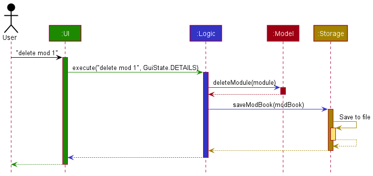
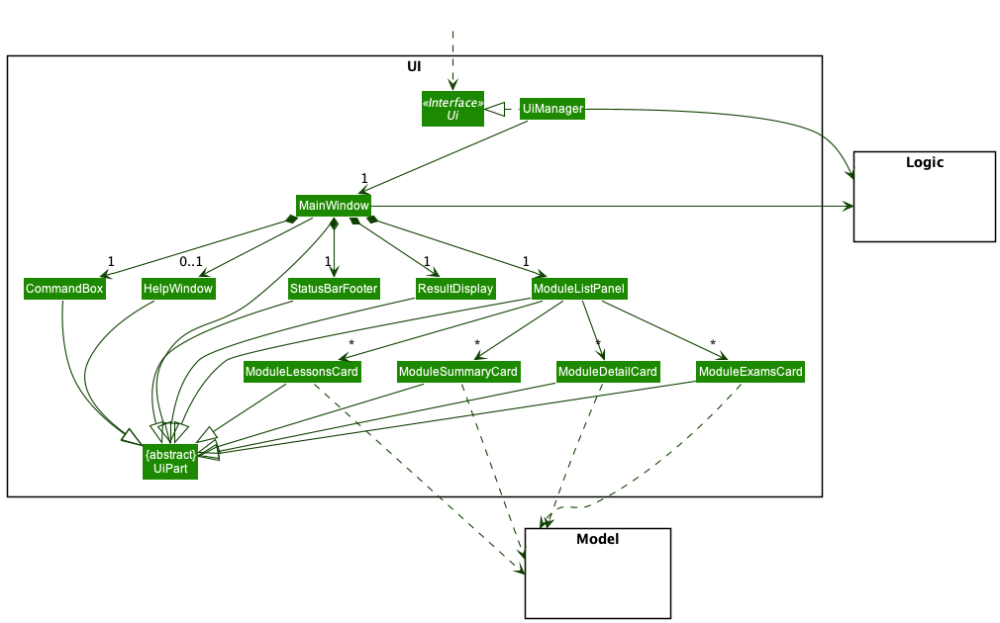
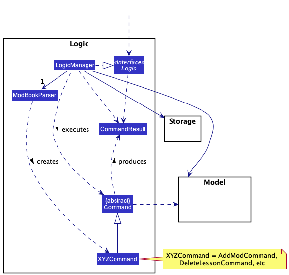
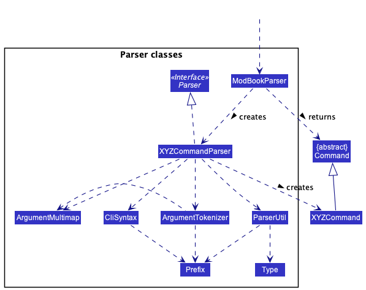
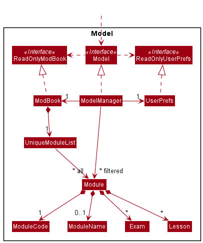
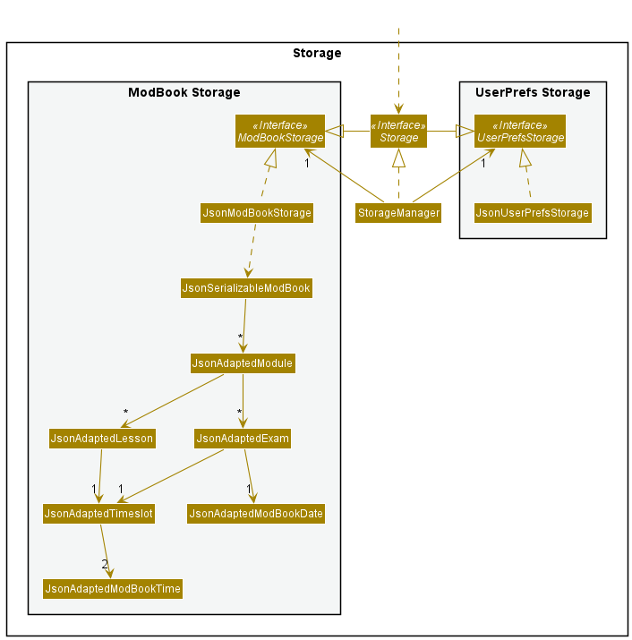

* Table of Contents
{:toc}

---

## **Acknowledgements**

- Adapted from [AddressBook-Level3 Developer guide](https://se-education.org/addressbook-level3/DeveloperGuide.html)

---

## **Setting up, getting started**

Refer to the guide [_Setting up and getting started_](SettingUp.md).

---

## **Design**

:bulb: **Tip:** The `.puml` files used to create diagrams in this document can be found in the [diagrams](https://github.com/AY2122S1-CS2103T-T13-1/tp/tree/master/docs/diagrams) folder. Refer to the [_PlantUML Tutorial_ at se-edu/guides](https://se-education.org/guides/tutorials/plantUml.html) to learn how to create and edit diagrams.

### Architecture

The **_Architecture Diagram_** given above explains the high-level design of the App.

Given below is a quick overview of main components and how they interact with each other.

**Main components of the architecture**

**`Main`** has two classes called [`Main`](https://github.com/AY2122S1-CS2103T-T13-1/tp/blob/master/src/main/java/seedu/address/Main.java) and [`MainApp`](https://github.com/AY2122S1-CS2103T-T13-1/tp/blob/master/src/main/java/seedu/address/MainApp.java). It is responsible for,

- At app launch: Initializes the components in the correct sequence, and connects them up with each other.
- At shut down: Shuts down the components and invokes cleanup methods where necessary.

[**`Commons`**](#common-classes) represents a collection of classes used by multiple other components.

The rest of the App consists of four components.

- [**`UI`**](#ui-component): The UI of the App.
- [**`Logic`**](#logic-component): The command executor.
- [**`Model`**](#model-component): Holds the data of the App in memory.
- [**`Storage`**](#storage-component): Reads data from, and writes data to, the hard disk.

**How the architecture components interact with each other**

The _Sequence Diagram_ below shows how the components interact with each other for the scenario where the user issues the command `delete 1`.

Each of the four main components (also shown in the diagram above),

- defines its _API_ in an `interface` with the same name as the Component.
- implements its functionality using a concrete `{Component Name}Manager` class (which follows the corresponding API `interface` mentioned in the previous point.

For example, the `Logic` component defines its API in the `Logic.java` interface and implements its functionality using the `LogicManager.java` class which follows the `Logic` interface. Other components interact with a given component through its interface rather than the concrete class (reason: to prevent outside component's being coupled to the implementation of a component), as illustrated in the (partial) class diagram below.

The sections below give more details of each component.

### UI component

The **API** of this component is specified in [`Ui.java`](https://github.com/AY2122S1-CS2103T-T13-1/tp/blob/master/src/main/java/seedu/address/ui/Ui.java)

The UI consists of a `MainWindow` that is made up of parts e.g.`CommandBox`, `ResultDisplay`, `ModuleListPanel`, `StatusBarFooter` etc. All these, including the `MainWindow`, inherit from the abstract `UiPart` class which captures the commonalities between classes that represent parts of the visible GUI.

The `UI` component uses the JavaFx UI framework. The layout of these UI parts are defined in matching `.fxml` files that are in the `src/main/resources/view` folder. For example, the layout of the [`MainWindow`](https://github.com/AY2122S1-CS2103T-T13-1/tp/blob/master/src/main/java/seedu/address/ui/MainWindow.java) is specified in [`MainWindow.fxml`](https://github.com/AY2122S1-CS2103T-T13-1/tp/blob/master/src/main/resources/view/MainWindow.fxml)

The `UI` component,

- executes user commands using the `Logic` component.
- listens for changes to `Model` data so that the UI can be updated with the modified data.
- keeps a reference to the `Logic` component, because the `UI` relies on the `Logic` to execute commands.
- depends on some classes in the `Model` component, as it displays `Module` objects residing in the `Model`.
- keeps a reference to the current screen state as a `GuiState` in order to restrict some commands to certain screens (more on this under `Restricting Commands based on GUI state` in the `Implementation` section below).
- changes the screen based on the return value of CommandResult.

#### Design considerations:

**Aspect: How to change UI screen based on the command**

* **Alternative 1 (current choice)**: Create card classes for each type of screen and change rendered card based on return value of CommandResult.
    * Pros: Readability is enhanced, easily extendable.
    * Cons: Coupling of UI component is reduced; logic needs to be added to CommandResult to change the current screen.
* **Alternative 2**: Have a single rendered ModuleCard that changes text based on the type of the object in the ObservableList.
    * Pros: Easier to implement.
    * Cons: Harder to extend; can lead to a monolithic ModuleCard that handles all views.

### Logic component

**API** : [`Logic.java`](https://github.com/AY2122S1-CS2103T-T13-1/tp/blob/master/src/main/java/seedu/address/logic/Logic.java)

Here's a (partial) class diagram of the `Logic` component:

How the `Logic` component works:

1. When `Logic` is called upon to execute a command, it uses the `ModBookParser` class to parse the user command together with the current state of the GUI (`GuiState`).
2. This results in a `Command` object (more precisely, an object of one of its subclasses e.g., `AddModCommand`) which is executed by the `LogicManager`.
3. The command can communicate with the `Model` when it is executed (e.g. to add a module).
4. The result of the command execution is encapsulated as a `CommandResult` object which is returned back from `Logic`.

The Sequence Diagram below illustrates the interactions within the `Logic` component for the `execute("delete mod 1")` API call.

:information_source: **Note:** The lifeline for `DeleteCommandParser` should end at the destroy marker (X) but due to a limitation of PlantUML, the lifeline reaches the end of diagram.

Here are the other classes in `Logic` (omitted from the class diagram above) that are used for parsing a user command:

How the parsing works:

- When called upon to parse a user command, the `ModBookParser` class creates a `XYZCommandParser` (`XYZ` is a placeholder for the specific command name e.g., `DeleteCommandParser`) which uses the other classes shown above to parse the user command and create a `XYZCommand` object (e.g., `DetailCommand`) which the `ModBookParser` returns back as a `Command` object.
- The name of the `Command` Object may also include the type of object the command is acting on. For example, `delete mod` command returns  a `deleteModCommand` object, `delete lesson` command returns a `deleteLessonCommand` object and `delete exam` command returns a `deleteExamCommand` object.
- All `XYZCommandParser` classes (e.g., `AddCommandParser`, `DeleteCommandParser`, ...) inherit from the `Parser` interface so that they can be treated similarly where possible e.g, during testing.

### Model component

**API** : [`Model.java`](https://github.com/AY2122S1-CS2103T-T13-1/tp/blob/master/src/main/java/seedu/address/model/Model.java)

The `Model` component,

- stores the address book data i.e., all `Module` objects (which are contained in a `UniqueModuleList` object).
- stores the currently 'selected' `Module` objects (e.g., results of a search query) as a separate _filtered_ list which is exposed to outsiders as an unmodifiable `ObservableList<Module>` that can be 'observed' e.g. the UI can be bound to this list so that the UI automatically updates when the data in the list change.
- stores a `UserPref` object that represents the user’s preferences. This is exposed to the outside as a `ReadOnlyUserPref` objects.
- does not depend on any of the other three components (as the `Model` represents data entities of the domain, they should make sense on their own without depending on other components)

### Storage component

**API** : [`Storage.java`](https://github.com/AY2122S1-CS2103T-T13-1/tp/blob/master/src/main/java/seedu/address/storage/Storage.java)

The `Storage` component,

* can save both module data and user preference data in json format, and read them back into corresponding objects.
* inherits from both `ModBookStorage` and `UserPrefStorage`, which means it can be treated as either one (if only the functionality of only one is needed).
* depends on some classes in the `Model` component (because the `Storage` component's job is to save/retrieve objects that belong to the `Model`)

The sequence diagram of how this works for an `add lesson` command is found below. The objects in `Model` and `UI`, as well as time-related objects, are omitted for simplicity.

When storing the `ModBook`, the respective `JsonAdaptedObject` classes will create adaptations of objects in the `Model`, allowing `JsonUtil` to store the objects and save them to the `filePath` specified in `UserPrefs`.

#### Design considerations:

**Aspect: How to save components of Modules (Lesson / Exam / Timeslot / ModBookTime / ModBookDate):**

* **Alternative 1 (current choice)**: Create respective `JsonAdaptedObject` classes for each type of object.
    * Pros: Greatly increases the readability of the JSON storage file
    * Cons: Many objects must be created when a Lesson or Exam is being stored.
* **Alternative 2**: Encode `Lesson`, `Exam` and other components into `String` objects to be stored as properties of a `JsonAdaptedModule`.
    * Pros: Easier to implement the writing of JSON files.
    * Cons: Difficult to parse JSON output - have to figure out how to decode `String` objects to `Lesson`, `Exam` and other objects in the `Model`.

### Common classes

Classes used by multiple components are in the `seedu.addressbook.commons` package.

---

## **Implementation**

This section describes some noteworthy details on how certain features are implemented.

### Restricting Commands based on GUI state

#### Rationale

Some commands, e.g. `delete lesson` and `edit exam` should not be used in the view where the `Modules` are listed.
This is because the `delete` and `edit` commands are indexed based, and in the `Modules` view, there are multiple `Lesson`s or `Exam`s displayed with the same index.
Hence, there is a need to restrict these commands to the Module Details view, so that there is no ambiguity about which `Lesson` or `Exam` to delete.

Thus, before commands are executed, the GUI state of the application needs to be checked to see if it is valid.

#### Implementation

To implement this feature, the GUI needs to keep track of which state it is in, so a field in `MainWindow` was created to store the `GuiState`.
In addition, the `Logic#execute()` method has an additional `GuiState` parameter, which will be the current `GuiState` of the `MainWindow`, and the `Parser` interface was modified so that `parse` also takes in a `GuiState` parameter.
After the command is executed, the `GuiState` of the `MainWindow` is updated with the `GuiState` of the returned `CommandResult`.

The class diagram of how UI and Logic interact with each other is shown below.

The sequence diagram of how this works for a `delete` command is found below. The objects in `Model` and `Storage` are not shown for simplicity.

When parsing, the respective `Parser` will check the current `GuiState` with the allowed `GuiState`s. If the `GuiState` is valid, it will proceed with parsing the command.
Otherwise, it will throw a `GuiStateException`.

#### Design considerations:

**Aspect: How to implement edit/delete lessons/exams:**

- **Alternative 1 (current choice)**: Limits these two commands to the Module Details view.
  - Pros: Easier to implement.
  - Cons: Requires passing `GuiState` from the `UI` component to the `Logic` component, reducing cohesion.
- **Alternative 2**: Combine the lists of lessons and exams into one central list in the List Lessons or Exams view respectively.
  - Pros: Does not require `MainWindow` to keep track of its current `GuiState`.
  - Cons: Difficult to implement - have to figure out how to map the `Lesson` or `Exam` from the central list to its original module.
  
---

## **Documentation, logging, testing, configuration, dev-ops**

- [Documentation guide](Documentation.md)
- [Testing guide](Testing.md)
- [Logging guide](Logging.md)
- [Configuration guide](Configuration.md)
- [DevOps guide](DevOps.md)

---

## **Appendix: Requirements**

### Product scope

**Target user profile:**

- has a need to manage modules and lessons related to the modules
- prefer desktop apps over other types
- can type fast
- prefers typing to mouse interactions
- is reasonably comfortable using CLI apps

**Value proposition**: manage modules faster NUSMods

### User stories

Priorities: High (must have) - `***`, Medium (nice to have) - `**`, Low (unlikely to have) - `*`

| Priority | As a...     | I want to...                           | So that I can                                          |
| -------- | ----------- | -------------------------------------- | ------------------------------------------------------ |
| `***`    | new user    | see usage instructions                 | refer to instructions when I forget how to use the App |
| `***`    | NUS student | add modules to a module list           | keep track of my daily schedule                        |
| `***`    | NUS student | edit my modules                        | update changes in my curriculum plan                   |
| `***`    | NUS student | delete modules                         | update any withdrawal from modules                     |
| `***`    | NUS student | see a list of my modules               | have an overview of all my schoolwork                  |
| `***`    | NUS student | add lessons to a lesson list           | keep track of my lesson schedule                       |
| `***`    | NUS student | edit my lessons                        | update changes in the lesson schedule                  |
| `***`    | NUS student | delete my lessons                      | update if any lessons are cancelled                    |
| `***`    | NUS student | see a list of upcoming lessons         | plan my week ahead                                     |
| `***`    | NUS student | add examinations to a examination list | keep track of my examination schedule                  |
| `***`    | NUS student | edit my examinations                   | update any changes in the examinations                 |
| `***`    | NUS student | delete my examinations                 | update if any examinations are cancelled               |
| `***`    | NUS student | see a list of upcoming examinations    | plan my revision nearing the examination period        |

### Use cases

(For all use cases below, the **System** is the `ModBook` and the **Actor** is the `user`, unless specified otherwise)

**Use case: Add a module**

**MSS**

1. User types in code and name of module
2. ModBook adds that module into the list
3. ModBook displays the added module

Use case ends.

**Extensions**
1a. User types in a wrong parameter  
&nbsp;&nbsp;&nbsp; 1a1. ModBook outputs error message indicating parameter which has an error  
&nbsp;&nbsp;&nbsp; 1a2. User enters new data  
&nbsp;&nbsp;&nbsp; 1a3. Use case resumes from step 1

**Use case: Add a lesson**

**MSS**

1. User types in module code, day of week, start time, end time, and optionally link and venue details
2. ModBook adds the lesson to the specified module
3. ModBook displays the added lesson

Use case ends.

**Extensions**  
1a. User types in a wrong parameter  
&nbsp;&nbsp;&nbsp; 1a1. ModBook outputs error message indicating parameter which has an error  
&nbsp;&nbsp;&nbsp; 1a2. User enters new data  
&nbsp;&nbsp;&nbsp; 1a3. Use case resumes from step 1

**Use case: Add an exam**

**MSS**

1. User types in exam code, name, time and optionally link and venue
2. ModBook adds the exam to the specified module
3. ModBook displays the added exam

Use case ends.

**Extensions**  
1a. User types in a wrong parameter  
&nbsp;&nbsp;&nbsp; 1a1. ModBook outputs error message indicating parameter which has an error  
&nbsp;&nbsp;&nbsp; 1a2. User enters new data  
&nbsp;&nbsp;&nbsp; 1a3. Use case resumes from step 1

**Use case: List all modules**

**MSS**

1. User requests to see a list of all modules
2. ModBook displays a list of all modules

Use case ends.

**Extensions**  
1a. User types in a wrong parameter  
&nbsp;&nbsp;&nbsp; 1a1. ModBook outputs error message indicating parameter which has an error  
&nbsp;&nbsp;&nbsp; 1a2. User enters new data  
&nbsp;&nbsp;&nbsp; 1a3. Use case resumes from step 1

**Use case: List all lessons across modules**

**MSS**

1. User requests to see a list of all lessons
2. ModBook displays a list of all lessons, sorted by Day and Time

Use case ends.

**Extensions**  
1a. User types in a wrong parameter  
&nbsp;&nbsp;&nbsp; 1a1. ModBook outputs error message indicating parameter which has an error  
&nbsp;&nbsp;&nbsp; 1a2. User enters new data  
&nbsp;&nbsp;&nbsp; 1a3. Use case resumes from step 1

**Use case: List all exams across modules**

**MSS**

1. User requests to see a list of all exams
2. ModBook displays a list of all exams, sorted by Date and Time

Use case ends.

**Extensions**  
1a. User types in a wrong parameter  
&nbsp;&nbsp;&nbsp; 1a1. ModBook outputs error message indicating parameter which has an error  
&nbsp;&nbsp;&nbsp; 1a2. User enters new data  
&nbsp;&nbsp;&nbsp; 1a3. Use case resumes from step 1

**Use case: List lessons and exams for one module**

**MSS**

1. User requests to see list of all lessons and exams of the specified module
2. ModBook displays a list of all Exams and Lessons of the specified module

Use case ends.

**Extensions**  
1a. User types in a wrong parameter  
&nbsp;&nbsp;&nbsp; 1a1. ModBook outputs error message indicating parameter which has an error  
&nbsp;&nbsp;&nbsp; 1a2. User enters new data  
&nbsp;&nbsp;&nbsp; 1a3. Use case resumes from step 1

**Use case: Delete a module**

**MSS**

1. User requests to delete a module
2. ModBook deletes the module and returns success

Use case ends.

**Extensions**  
1a. User types in a wrong parameter  
&nbsp;&nbsp;&nbsp; 1a1. ModBook outputs error message indicating parameter which has an error  
&nbsp;&nbsp;&nbsp; 1a2. User enters new data  
&nbsp;&nbsp;&nbsp; 1a3. Use case resumes from step 1

**Use case: Delete a lesson**

**MSS**

1. User requests to delete a lesson
2. ModBook deletes the module and returns success

Use case ends.

**Use case: Delete an exam**

**MSS**

1. User requests to delete an exam associated with a module
2. ModBook deletes the module and returns success

**Extensions**  
1a. User types in a wrong parameter  
&nbsp;&nbsp;&nbsp; 1a1. ModBook outputs error message indicating parameter which has an error  
&nbsp;&nbsp;&nbsp; 1a2. User enters new data  
&nbsp;&nbsp;&nbsp; 1a3. Use case resumes from step 1

Use case ends.

**Use case: Edit a module**

**MSS**

1. User requests to edit a module
2. ModBook edits the module at the specified index

**Extensions**  
1a. User types in a wrong parameter  
&nbsp;&nbsp;&nbsp; 1a1. ModBook outputs error message indicating parameter which has an error  
&nbsp;&nbsp;&nbsp; 1a2. User enters new data  
&nbsp;&nbsp;&nbsp; 1a3. Use case resumes from step 1

Use case ends.

**Use case: Edit a lesson**

**MSS**

1. User requests to edit a lesson
2. Modbook edits the lesson and returns success message

**Extensions**  
1a. User types in a wrong parameter  
&nbsp;&nbsp;&nbsp; 1a1. ModBook outputs error message indicating parameter which has an error  
&nbsp;&nbsp;&nbsp; 1a2. User enters new data  
&nbsp;&nbsp;&nbsp; 1a3. Use case resumes from step 1

Use case ends.

**Use case: Edit an exam**

**MSS**

1. User requests to edit an exam
2. ModBook edits the exam and returns success message

**Extensions**  
1a. User types in a wrong parameter  
&nbsp;&nbsp;&nbsp; 1a1. ModBook outputs error message indicating parameter which has an error  
&nbsp;&nbsp;&nbsp; 1a2. User enters new data  
&nbsp;&nbsp;&nbsp; 1a3. Use case resumes from step 1

Use case ends.

**Use case: Display help**

**MSS**

1. User requests for help
2. ModBook presents a link to a help page

**Extensions**  
1a. User types in a wrong parameter  
&nbsp;&nbsp;&nbsp; 1a1. ModBook outputs error message indicating parameter which has an error  
&nbsp;&nbsp;&nbsp; 1a2. User enters new data  
&nbsp;&nbsp;&nbsp; 1a3. Use case resumes from step 1

Use case ends.

**Use case: Clear all modules**

**MSS**

1. User requests to clear all modules
2. ModBook clears all modules

**Extensions**  
1a. User types in a wrong parameter  
&nbsp;&nbsp;&nbsp; 1a1. ModBook outputs error message indicating parameter which has an error  
&nbsp;&nbsp;&nbsp; 1a2. User enters new data
&nbsp;&nbsp;&nbsp; 1a3. Use case resumes from step 1

Use case ends.

### Non-Functional Requirements

1. Should work on any _mainstream OS_ as long as it has **`Java 11`** or above installed.
1. Should be able to hold up to 1000 modules without a noticeable sluggishness in performance for typical usage.
1. A user with above average typing speed for regular English text (i.e. not code, not system admin commands) should be able to accomplish most of the tasks faster using commands than using the mouse.

### Glossary

- **Mainstream OS**: Windows, Linux, Unix, macOS

---

## **Appendix: Instructions for manual testing**

Given below are instructions to test the app manually.

:information_source: **Note:** These instructions only provide a starting point for testers to work on;
testers are expected to do more *exploratory* testing.

### Launch and shutdown

1. Initial launch

   1. Download the jar file and copy into an empty folder

   1. Double-click the jar file Expected: Shows the GUI with a set of sample modules. The window size may not be optimum.

1. Saving window preferences

   1. Resize the window to an optimum size. Move the window to a different location. Close the window.

   1. Re-launch the app by double-clicking the jar file. 
      Expected: The most recent window size and location is retained.

1. _{ more test cases …​ }_

### Deleting a module

1. Deleting a module while all module are being shown

   1. Prerequisites: List all module using the `list` command. Multiple module in the list.

   1. Test case: `delete 1` 
      Expected: First module is deleted from the list. Details of the deleted module shown in the status message. Timestamp in the status bar is updated.

   1. Test case: `delete 0` 
      Expected: No module is deleted. Error details shown in the status message. Status bar remains the same.

   1. Other incorrect delete commands to try: `delete`, `delete x`, `...` (where x is larger than the list size) 
      Expected: Similar to previous.

1. _{ more test cases …​ }_

### Saving data

1. Dealing with missing/corrupted data files

   1. _{explain how to simulate a missing/corrupted file, and the expected behavior}_

1. _{ more test cases …​ }_
