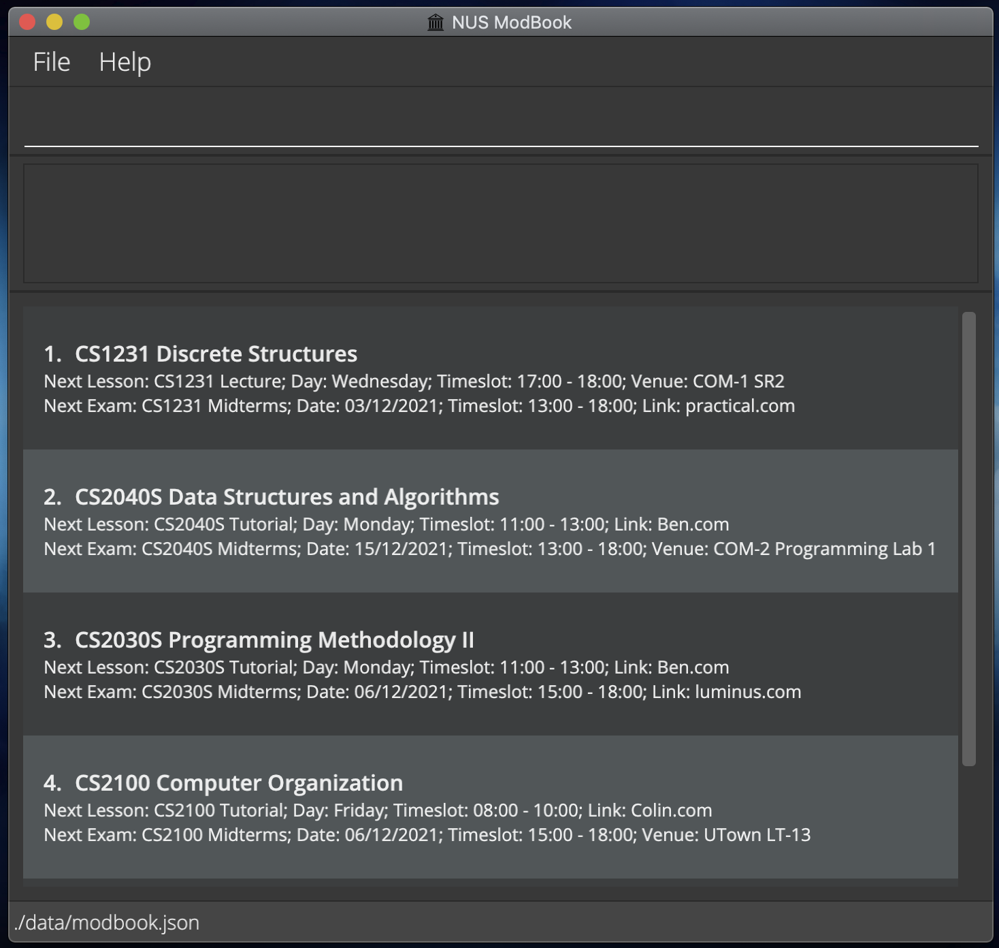
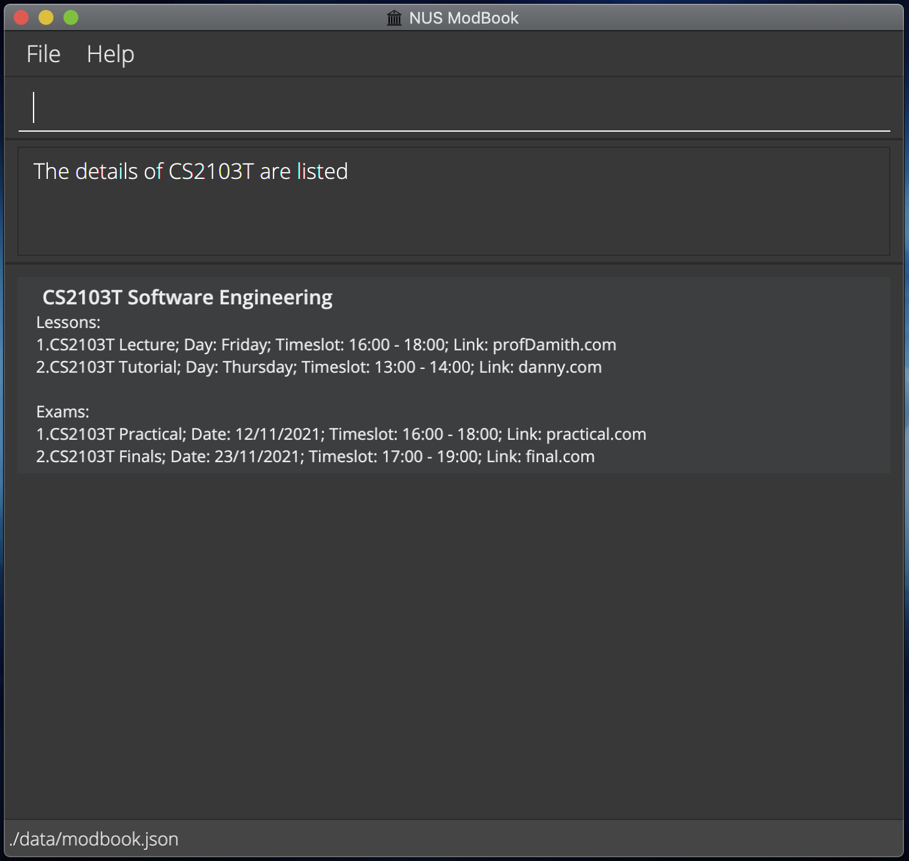
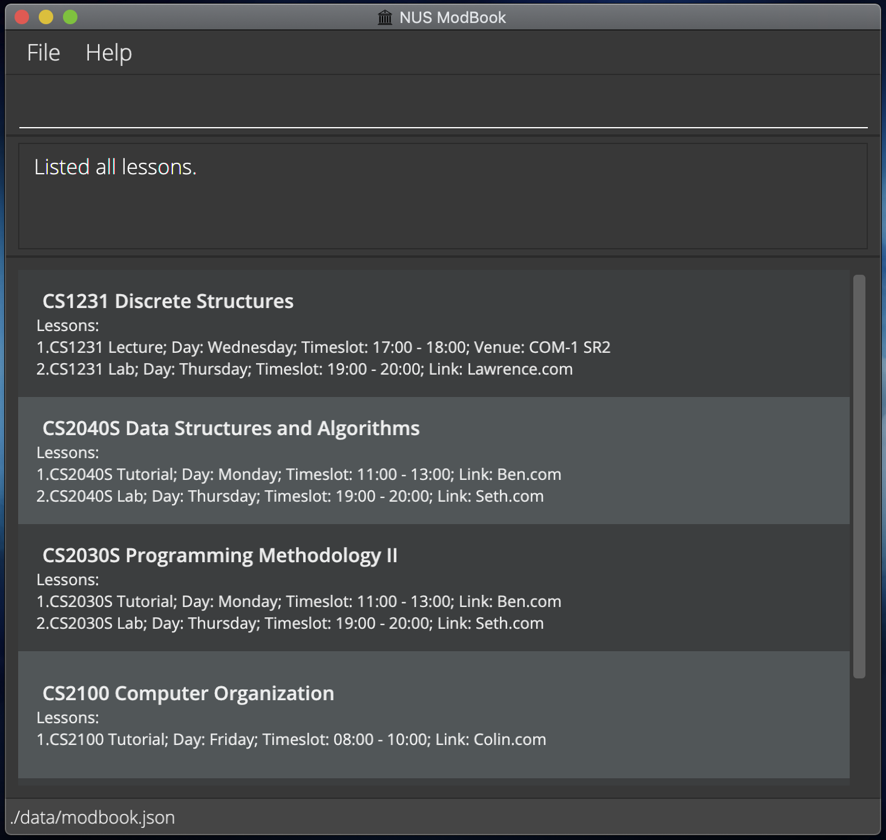

NUS ModBook is a **desktop app for NUS students to manage modules, optimized for use via a Command Line Interface** (CLI) while still having the benefits of a Graphical User Interface (GUI). If you can type fast, ModBook can help you organise modules faster than traditional GUI apps.

This guide will give you an overview of all the features of ModBook, as well as details regarding each command. If this is your first time here, head over to the [Quick Start](#quick-start) section to begin!

* Table of Contents
{:toc}

## Quick Start

1. Ensure you have Java `11` or above installed in your Computer.
2. Download the latest `modbook.jar` from [here](https://github.com/AY2122S1-CS2103T-T13-1/tp/releases).
3. Copy the file to the folder you want to use as the home folder for your ModBook.
4. Double-click the file to start the app. The GUI similar to the one shown below should appear in a few seconds. Note how the app contains some sample data.

  

5. Try out some example commands by typing it in the command box and pressing Enter:

   - `list mod`: Lists all modules.
   - `add mod c/CS2103T n/Software Engineering`: Adds a module with code CS2103T, named Software Engineering.
   - `delete mod 1`: Deletes the 1st module shown in the module list.
   - `clear`: Deletes all modules.
   - `exit`: Exits the app.

6. Refer to the guides below for details of each command.

## Screen Views

The following are the four screen views available in NUS ModBook. You can switch between them to view different information.

### Modules View

See all the modules with the next lesson and exam for each module. Use the [list mod](#listing-all-modules-list-mod) command to access this view.

### Details View

See all the lessons and modules for a given module. Use the [detail](#show-details-of-a-module-detail) command to access this view.

### Lessons View

See all the lessons of all modules. Use the [list lesson](#listing-all-lessons-list-lesson) command to access this view.

### Exams View

See all the exams of all modules. Use the [list exam](#listing-all-exams-list-exam) command to access this view.

## Features

:information_source: **Notes about Commands**<a name="notes-about-commands"> 

- Words in `UPPER_CASE` are the parameters to be supplied by you.
  - E.g. In add `c/CODE`, `CODE` is a parameter which can be used as `add mod c/CS2103T`.
- Items in square brackets are optional.
  - E.g. `c/CODE [n/NAME]` can be used as `c/CS2103T` or as `c/CS2103T n/Software Engineering`.
- Parameters can be in any order.
  - E.g. If the command specifies `c/CODE n/NAME`, `n/NAME c/CODE` is also acceptable.
- If a parameter is expected only once in the command but you specified it multiple times, only the last occurrence of the parameter will be taken.
  - E.g. If you specify `p/12341234 p/56785678`, only `p/56785678` will be taken.
- Extra parameters for commands that do not take in parameters (such as `help`, `exit` and `clear`) will be ignored.
  - E.g. If you type the command `help 123`, it will be interpreted as `help`.
- For commands which expect indexes, the index must be before any parameter prefix (e.g. `c/`, `s/`) specified
  - E.g. If you specify `edit mod 1 c/CS1231S`, you would change the module code of the first module to CS1231S.
  - However, If you specify `edit mod c/CS1231S 1`, you would get an error
- In addition, the last integer given, if any, will be used as the input argument. Any non-integer values given will be ignored.
  - If you specify `delete lesson 1 3 2`, only `2` will be taken as the index.
  - If you specify `delete lesson 1 3 a b`, only `3` will be taken as the index.
  - Note that this effectively means that even if your last integer is invalid, it will be taken to be the index. E.g. if you specify `delete lesson 1 2 -1`, the invalid integer `-1` will be taken as the index.
- Some commands such as `delete` and `edit` can only be executed from certain screens. These requirements will be further explained in the descriptions of the commands below.

### Modules

#### Adding a module: `add mod`

Adds a module to the ModBook. You can only execute this command in the [modules view](#modules-view).

Format: `add mod c/CODE [n/NAME]`

Examples:

- `add mod c/CS2103T n/Software Engineering` : Adds a module with code CS2103T, named Software Engineering.
- `add mod c/CS2040S` : Adds a module with code CS2040S, without a given name.

#### Listing all modules: `list mod`

Shows a list of all modules in the ModBook. You can execute this command in any view.

Format: `list mod`

#### Show details of a module: `detail`

Show details of an existing module in the ModBook. A list of all Lessons and Exams of the specified Module is printed. You can execute this command in any view.

Format: `detail c/CODE`

Example:

- `detail c/CS2103T` : Shows details for the CS2103T module.

#### Editing a module: `edit mod`

Edits an existing module in the ModBook. You can only execute this command in the [modules view](#modules-view).

Format: `edit mod INDEX [c/NEW_CODE] [n/NEW_NAME]`

- Edits the module at the specified `INDEX`. The index refers to the index number shown in the displayed module list. The index must be a positive integer 1, 2, 3, …​, not greater than 1,000,000.
- At least one of the optional fields must be provided.
- Existing values will be updated to the input values.

Examples:

- `edit mod 1 n/Computer Networks` : Edits the name of the first module to Computer Networks
- `edit mod 1 c/CS2106` : Edits the code of the first module to CS2106

#### Delete a module: `delete mod`

Deletes a module from the ModBook. You can only execute this command in the [modules view](#modules-view).

Format: `delete mod INDEX`

- Deletes the module at the specified INDEX.
- The index refers to the index number shown in the displayed module list.
- The index must be a positive integer 1, 2, 3, …​, not greater than 1,000,000.

Example:

- `delete mod 2` : deletes the 2nd module in the ModBook.

### Lessons

#### Adding a lesson: `add lesson`

Adds a lesson to the ModBook. You can only execute this command in the [details view](#details-view).

Format: `add lesson n/NAME d/DAY_OF_WEEK s/START_TIME e/END_TIME [l/LINK] [v/VENUE]`

Examples:

- `add lesson n/Weekly Tutorial d/Monday s/1000 e/1100 l/https://www.latlmes.com/breaking/click-this-link-for-exam-link-1`: Adds a lesson to the CS2103T module with a specified link.
- `add lesson n/Weekly Lab d/Monday s/1000 e/1100`: Adds a lesson to the CS2103T module without a specified link.

#### Listing all lessons: `list lesson`

Shows a list of all lessons in the ModBook. You can execute this command in any view.

Format: `list lesson`

#### Editing a lesson: `edit lesson`

Edits an existing lesson in the ModBook. You can only execute this command in the [details view](#details-view).

Format: `edit lesson INDEX [n/NEW_NAME] [d/NEW_DAY_OF_WEEK] [s/NEW_START_TIME] [e/NEW_END_TIME] [l/NEW_LINK] [v/NEW_VENUE]`

- Edits the lesson at the specified `INDEX`. The index refers to the index number shown in the displayed lesson list. The index must be a positive integer 1, 2, 3, …​, not greater than 1,000,000.
- Existing values will be updated to the input values.
- If you want to modify the timeslot, both `NEW_START_TIME` and `NEW_END_TIME` must be present.

Examples:

- `edit lesson 2 n/Weekly Tutorial` : Edits the name of the second lesson of the currently showing module.
- `edit lesson 2 l/www.zoom.com/newlessonlink` : Edits the link of the second lesson of the currently showing module.

#### Deleting a lesson: `delete lesson`

Deletes a lesson from the ModBook. You can only execute this command in the [details view](#details-view).

Format: `delete lesson INDEX`

- Deletes the lesson at the specified INDEX.
- The index refers to the index number shown in the displayed lesson list.
- The index must be a positive integer 1, 2, 3, …​, not greater than 1,000,000.

Example:

- `delete lesson 2`: Deletes the 2nd lesson of the module that is currently displayed.

### Exams

#### Adding an exam: `add exam`

Adds an exam to the ModBook. You can only execute this command in the [details view](#details-view).

Format: `add exam n/NAME d/DATE s/START_TIME e/END_TIME [l/LINK] [v/VENUE]`

Examples:

- `add exam n/Final Exam d/31/12/2022 s/2100 e/2200 v/MPSH`: Adds an exam to the current module with a specified venue.
- `add exam n/Midterms d/04/01/2021 s/2000 e/2200` Adds an exam to the current module.

#### Listing all Exams: `list exam`

Shows a list of all lessons in the ModBook. You can execute this command in any view.

Format: `list exam`

#### Editing an Exam: `edit exam`

Edits an existing exam in the ModBook. You can only execute this command in the [details view](#details-view).

Format: `edit exam 3 [n/NEW_NAME] [d/NEW_DATE] [s/NEW_START_TIME] [e/NEW_END_TIME] [l/NEW_LINK] [v/NEW_VENUE]`

- Edits the exam at the specified `INDEX`. The index refers to the index number shown in the displayed exam list. The index must be a positive integer 1, 2, 3, …​, not greater than 1,000,000.
- Existing values will be updated to the input values.
- If you want to modify the timeslot, both `NEW_START_TIME` and `NEW_END_TIME` must be present.

Examples:

- `edit exam 3 n/Final Exam d/31/12/2022 s/2100 e/2200 l/https://www.latlmes.com/breaking/click-this-link-for-exam-link-1`: Edits the 3rd exam of the CS2103T module.
- `edit exam 4 n/Final d/31/12/2022 s/2000 e/2100`: Edits the 4th exam of CS2100 module.

#### Deleting an Exam: `delete exam`

Deletes the specified Exam from the ModBook. You can only execute this command in the [details view](#details-view).

Format: `delete exam INDEX`

- Deletes the Exam at the specified index.
- The index refers to the index number shown in the displayed exam list.
- The index must be a positive integer 1, 2, 3, …​, not greater than 1,000,000.

Example:

- `delete exam 3` : Deletes the 3rd exam of the module that is currently displayed.

### Miscellaneous

You can execute the following commands in any view.

#### Viewing help: `help`

Shows a message explaining how to access the help page. Format: `help`

#### Clearing all entries: `clear`

Clears all entries from the ModBook. Format: `clear`

#### Exiting the program: `exit`

Exits the program. Format: `exit`

#### Saving the data

ModBook data is saved in the hard disk automatically after you execute any command that changes the data. There is no need to save manually.

#### Editing the data file

ModBook data is saved as a JSON file `[JAR file location]/data/modbook.json`. Advanced users are welcome to update data directly by editing that data file once the application is closed. Note that the `modbook.json` file is only created once a valid command is entered.

> :warning: **Caution**: If your changes to the data file make the format invalid, ModBook will discard all data and start with an empty data file at the next run.

## FAQ

**Q**: How do I transfer my data to another Computer?

**A**: Install the app in the other computer and overwrite the empty data file it creates with the file that contains the data of your previous ModBook home folder.

## Day, Date and Time Formats

### Valid formats for entering day values

| Day of Week | Format                             |
|-------------|------------------------------------|
| Monday      | `Monday`, `Mon`                    |
| Tuesday     | `Tuesday`, `Tues`, `Tue`           |
| Wednesday   | `Wednesday`, `Wed`                 |
| Thursday    | `Thursday`, `Thurs`, `Thur`, `Thu` |
| Friday      | `Friday`, `Fri`                    |
| Saturday    | `Saturday`, `Sat`                  |
| Sunday      | `Sunday`, `Sun`                    |

- The formats are case-insensitive, i.e. both `Monday` and `mon` are valid.

### Valid formats for entering date values

| Format         | Examples           |
| -------------- | ------------------ |
| `dd/MM/yyyy`   | `02/02/1999`       |
| `dd.MM.yyyy`   | `02.02.1999`       |
| `dd-MM-yyyy`   | `02-02-1999`       |
| `ddMMyyyy`     | `02021999`         |
| `dd MM yyyy`   | `02 02 1999`       |
| `dd LLLL yyyy` | `02 February 1999` |
| `dd LLL yyyy`  | `02 Feb 1999`      |
| `d LLLL yyyy`  | `2 february 1999`  |
| `d LLL yyyy`   | `2 feb 1999`       |

- Refer to the table below for clarification of the symbols used:

| Symbol | Meaning                                 |
| ------ | --------------------------------------- |
| L      | Month as text                           |
| M      | Month as number                         |
| y      | Year                                    |
| d      | day of month                            |

### Valid formats for entering time values

| Format   | Examples             |
| -------- | -------------------- |
| `HH:mm`  | `09:00`, `14:30`     |
| `HH.mm`  | `09.00`, `14.30`     |
| `HHmm`   | `0900`, `1430`       |
| `ha`     | `9AM`, `2pm`         |
| `hha`    | `09AM`, `11pm`       |
| `h:mma`  | `9:00AM`, `2:30pm`   |
| `hh:mma` | `09:00AM`, `11:30pm` |
| `h.mma`  | `9.00AM`, `2.30pm`   |
| `hh.mma` | `09.00AM`, `11.30pm` |

- The input for `AM/PM` is case-insensitive, e.g. both `10AM` and `10am` are valid. Also, note that `2400` (i.e. midnight of the next day) is not a valid input.
- Refer to the table below for clarification of the symbols used:

| Symbol | Meaning                                 |
| ------ | --------------------------------------- |
| H      | Hour of 24-hour time. Goes from 0 to 23 |
| h      | Hour of 12-hour time. Goes from 1 to 12 |
| m      | Minute                                  |
| a      | AM/PM indicator                         |

## Command Summary

### Command Summary by Action

| Action | Object | Format                                                                                                                                                                                                      | View    |
|--------|--------|-------------------------------------------------------------------------------------------------------------------------------------------------------------------------------------------------------------|---------|
| Add    | Module | [`add mod c/CODE [n/NAME]`](#adding-a-module-add-mod)   e.g. `add mod c/CS2103T n/Software Engineering`                                                                                                  | Modules |
|        | Lesson | [`add lesson n/NAME d/DAY_OF_WEEK s/START_TIME e/END_TIME [l/LINK] [v/VENUE]`](#adding-a-lesson-add-lesson)   e.g. `add lesson n/Weekly Lab d/Monday s/1000 e/1100 l/zoom.com/cs2103t`                   | Details |
|        | Exam   | [`add exam n/NAME d/DATE s/START_TIME e/END_TIME [l/LINK] [v/VENUE]`](#adding-an-exam-add-exam)   e.g. `add exam n/Final Exam d/31/12/2022 s/2100 e/2200 v/MPSH`                                         | Details |
| List   | Module | [`list mod`](#listing-all-modules-list-mod)                                                                                                                                                                | Any     |
|        | Lesson | [`list lesson`](#listing-all-lessons-list-lesson)                                                                                                                                                          | Any     |
|        | Exam   | [`list exam`](#listing-all-exams-list-exam)                                                                                                                                                                | Any     |
| Detail | Module | [`detail c/CODE`](#show-details-of-a-module-detail)   e.g. `detail c/CS2103T`                                                                                                                            | Any     |
| Delete | Module | [`delete mod INDEX`](#delete-a-module-delete-mod)                                                                                                                                                           | Modules |
|        | Lesson | [`delete lesson INDEX`](#deleting-a-lesson-delete-lesson)                                                                                                                                                   | Details |
|        | Exam   | [`delete exam INDEX`](#deleting-an-exam-delete-exam)                                                                                                                                                       | Details |
| Edit   | Module | [`edit mod INDEX [c/NEW_CODE] [n/NEW_NAME]`](#editing-a-module-edit-mod)   e.g. `edit mod 1 c/CS2040 n/Data Structures`                                                                                  | Modules |
|        | Lesson | [`edit lesson INDEX [n/NEW_NAME] [d/NEW_DAY_OF_WEEK] [s/NEW_START_TIME] [e/NEW_END_TIME] [l/NEW_LINK] [v/NEW_VENUE]`](#editing-a-lesson-edit-lesson)   e.g. `edit lesson 2 l/www.zoom.com/newlessonlink` | Details |
|        | Exam   | [`edit exam INDEX [n/NEW_NAME] [d/NEW_DATE] [s/NEW_START_TIME] [e/NEW_END_TIME] [l/NEW_LINK] [v/NEW_VENUE]`](#editing-an-exam-edit-exam)   e.g. `edit exam 4 n/Final d/31/12/2022 s/2000 e/2100`         | Details |
| Help   |        | [`help`](#viewing-help-help)                                                                                                                                                                               | Any     |
| Clear  |        | [`clear`](#clearing-all-entries-clear)                                                                                                                                                                     | Any     |
| Exit   |        | [`exit`](#exiting-the-program-exit)                                                                                                                                                                        | Any     |

### Command Summary by Object

| Object | Action | Format                                                                                                                                     | View    |
| ------ | ------ | ---------------------------------------------------------------------------------------------------------------------------------------------------- | ------- |
| Module | Add    | [`add mod c/CODE [n/NAME]`](#adding-a-module-add-mod)                                                                                                | Modules |
|        | Detail | [`detail c/CODE`](#show-details-of-a-module-detail)                                                                                                  | Any     |
|        | List   | [`list mod`](#listing-all-modules-list-mod)                                                                                                         | Any     |
|        | Edit   | [`edit mod INDEX [c/NEW_CODE] [n/NEW_NAME]`](#editing-a-module-edit-mod)                                                                             | Modules |
|        | Delete | [`delete mod INDEX`](#delete-a-module-delete-mod)                                                                                                    | Modules |
| Lesson | Add    | [`add lesson n/NAME d/DAY_OF_WEEK s/START_TIME e/END_TIME [l/LINK] [v/VENUE]`](#adding-a-lesson-add-lesson)                                          | Details |
|        | List   | [`list lesson`](#listing-all-lessons-list-lesson)                                                                                                   | Any     |
|        | Edit   | [`edit lesson INDEX [n/NEW_NAME] [d/NEW_DAY_OF_WEEK] [s/NEW_START_TIME] [e/NEW_END_TIME] [l/NEW_LINK] [v/NEW_VENUE]`](#editing-a-lesson-edit-lesson) | Details |
|        | Delete | [`delete lesson INDEX`](#deleting-a-lesson-delete-lesson)                                                                                            | Details |
| Exam   | Add    | [`add exam n/NAME d/DATE s/START_TIME e/END_TIME [l/LINK] [v/VENUE]`](#adding-an-exam-add-exam)                                                      | Details |
|        | List   | [`list exam`](#listing-all-exams-list-exam)                                                                                                         | Any     |
|        | Edit   | [`edit exam INDEX [n/NEW_NAME] [d/NEW_DATE] [s/NEW_START_TIME] [e/NEW_END_TIME] [l/NEW_LINK] [v/NEW_VENUE]`](#editing-an-exam-edit-exam)             | Details |
|        | Delete | [`delete exam INDEX`](#deleting-an-exam-delete-exam)                                                                                                | Details |
| Help   |        | [`help`](#viewing-help-help)                                                                                                                        | Any     |
| Clear  |        | [`clear`](#clearing-all-entries-clear)                                                                                                              | Any     |
| Exit   |        | [`exit`](#exiting-the-program-exit)                                                                                                                 | Any     |
